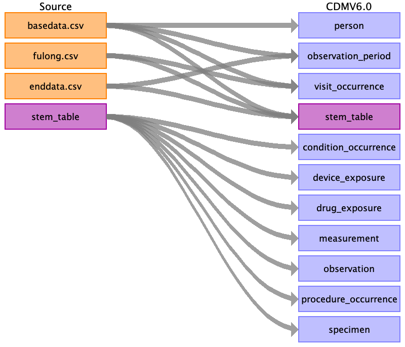

# PRIAS to OMOP CDM v6

## Introduction
Active surveillance of early prostate cancer.

PRIAS is an observational study, following 8000 men with prostate cancer at about 70 sites worldwide.
The data is collected by clinicians or data managers via an online portal. This data collection is still ongoing.
More information can be found at https://www.prias-project.org/.

People included in the PRIAS study have a histologically proven adenomcarcinoma of the prostate, and are not being
treated at the moment as the tumor is not aggresive. The full inclusiona and exclusion criteria can be found here:
https://www.prias-project.org/modules/articles/article.php?id=1.

