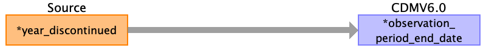

# observation_period
{: .no_toc }

## Reading From
{: .no_toc .text-delta }

1. TOC
{:toc}

---

## Reading from basedata.csv

| Destination Field             | Source field   | Logic | Comment field                                     |
|:------------------------------|:---------------|:------|:--------------------------------------------------|
| observation_period_id         |                |       |  Auto-increment                                   |
| person_id                     | p_id           |       |                                                   |
| observation_period_start_date | year_diagnosis |       | year-07-01                                        |
| observation_period_end_date   |                |       | If not provided in enddata, take extraction date 2099-07-01|
| period_type_concept_id        |                |       | Period while enrolled in study - 44814723         |

## Reading from enddata.csv

| Destination Field             | Source field      | Logic | Comment field                                                                                                                                                                  |
|:------------------------------|:------------------|:------|:-------------------------------------------------------------------------------------------------------------------------------------------------------------------------------|
| observation_period_id         |                   |       |  Auto-increment                                                                                                                                                                |
| person_id                     | p_id              |       |                                                                                                                                                                                |
| observation_period_start_date |                   |       |                                                                                                                                                                                |
| observation_period_end_date   | year_discontinued |       | year-07-01  There could be data after year_discontinued (follow up after active surveillance), not given in data extract. If not provided in enddata, take extraction date 2099-07-01|
| period_type_concept_id        |                   |       | Period while enrolled in study - 44814723                                                                                                                                      |

