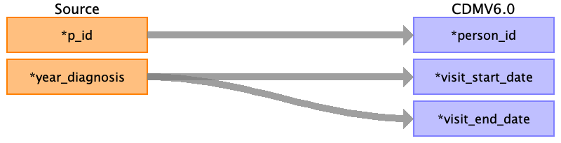

# visit_occurrence
{: .no_toc }

## Reading from
{: .no_toc .text-delta }

1. TOC
{:toc}

---

## Reading from basedata.csv

| Destination Field             | Source field   | Logic | Comment field                                                                                                                                  |
|:------------------------------|:---------------|:------|:-----------------------------------------------------------------------------------------------------------------------------------------------|
| visit_occurrence_id           |                |       | Auto-increment                                                                                                                                 |
| person_id                     | p_id           |       |                                                                                                                                                |
| visit_concept_id              |                |       | basedata visit -> baseline  followup visit -> visit 1 t/m xx (eventueel onderscheid lab/biopsy/evaluation/dre visit onderscheid, zie protocol) |
| visit_start_date              | year_diagnosis |       | year-07-01                                                                                                                                  |
| visit_start_datetime          |                |       |                                                                                                                                                |
| visit_end_date                | year_diagnosis |       | year-07-01                                                                                                                                  |
| visit_end_datetime            |                |       |                                                                                                                                                |
| visit_type_concept_id         |                |       | todo                                                                                                                                           |
| provider_id                   |                |       |                                                                                                                                                |
| care_site_id                  |                |       |                                                                                                                                                |
| visit_source_value            |                |       |                                                                                                                                                |
| visit_source_concept_id       |                |       |                                                                                                                                                |
| admitted_from_concept_id      |                |       |                                                                                                                                                |
| admitted_from_source_value    |                |       |                                                                                                                                                |
| discharge_to_concept_id       |                |       |                                                                                                                                                |
| discharge_to_source_value     |                |       |                                                                                                                                                |
| preceding_visit_occurrence_id |                |       |                                                                                                                                                |

## Reading from fulong.csv

| Destination Field             | Source field  | Logic | Comment field                                                                                                                                  |
|:------------------------------|:--------------|:------|:-----------------------------------------------------------------------------------------------------------------------------------------------|
| visit_occurrence_id           |               |       | Auto-increment                                                                                                                                 |
| person_id                     | p_id          |       |                                                                                                                                                |
| visit_concept_id              | time          |       | basedata visit -> baseline  followup visit -> visit 1 t/m xx (eventueel onderscheid lab/biopsy/evaluation/dre visit onderscheid, zie protocol) |
| visit_start_date              | days_psa_diag |       | year_diag + days_psa_diag                                                                                                                   |
| visit_start_datetime          |               |       |                                                                                                                                                |
| visit_end_date                | days_psa_diag |       | same as visit start                                                                                                                         |
| visit_end_datetime            |               |       |                                                                                                                                                |
| visit_type_concept_id         |               |       | todo                                                                                                                                           |
| provider_id                   |               |       |                                                                                                                                                |
| care_site_id                  |               |       |                                                                                                                                                |
| visit_source_value            |               |       |                                                                                                                                                |
| visit_source_concept_id       |               |       |                                                                                                                                                |
| admitted_from_concept_id      |               |       |                                                                                                                                                |
| admitted_from_source_value    |               |       |                                                                                                                                                |
| discharge_to_concept_id       |               |       |                                                                                                                                                |
| discharge_to_source_value     |               |       |                                                                                                                                                |
| preceding_visit_occurrence_id |               |       |                                                                                                                                                |

